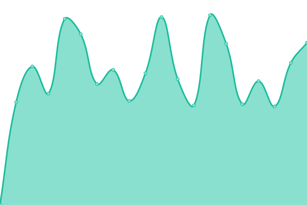
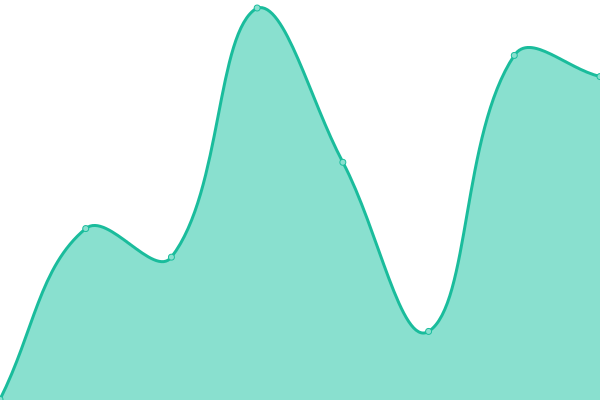
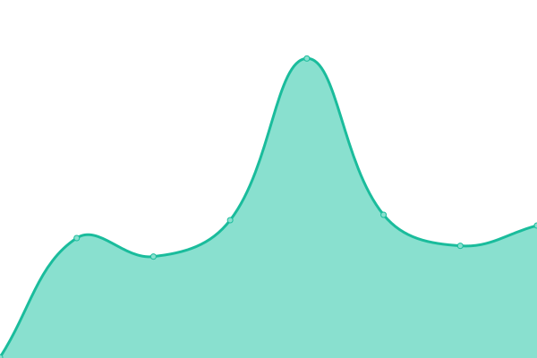

# [📈 Live Status](https://MacKisco.github.io/upptime): <!--live status--> **🟩 All systems operational**

This repository contains the open-source uptime monitor and status page for [MacKisco](https://MacKisco.github.io/upptime), powered by [Upptime](https://github.com/upptime/upptime).

With [Upptime](https://upptime.js.org), you can get your own unlimited and free uptime monitor and status page, powered entirely by a GitHub repository. We use [Issues](https://github.com/MacKisco/upptime/issues) as incident reports, [Actions](https://github.com/MacKisco/upptime/actions) as uptime monitors, and [Pages](https://MacKisco.github.io/upptime) for the status page.

<!--start: status pages-->
<!-- This summary is generated by Upptime (https://github.com/upptime/upptime) -->
<!-- Do not edit this manually, your changes will be overwritten -->
<!-- prettier-ignore -->
| URL | Status | History | Response Time | Uptime |
| --- | ------ | ------- | ------------- | ------ |
|  [Le Petit Atelier Luthi](https://lepetitatelierluthi.fr) | 🟩 Up | [le-petit-atelier-luthi.yml](https://github.com/MacKisco/upptime/commits/HEAD/history/le-petit-atelier-luthi.yml) | 

 1756ms
     
 | 

<a href="https://MacKisco.github.io/upptime/history/le-petit-atelier-luthi">100.00%</a>
    

|  [L'Eire de rien](https://leirederien.fr) | 🟩 Up | [l-eire-de-rien.yml](https://github.com/MacKisco/upptime/commits/HEAD/history/l-eire-de-rien.yml) | 

 1308ms
     
 | 

<a href="https://MacKisco.github.io/upptime/history/l-eire-de-rien">100.00%</a>
    

|  [Tea Menu](https://tea-menu.netlify.app) | 🟩 Up | [tea-menu.yml](https://github.com/MacKisco/upptime/commits/HEAD/history/tea-menu.yml) | 

 232ms
     
 | 

<a href="https://MacKisco.github.io/upptime/history/tea-menu">100.00%</a>
    

|  [Aviva-stats](https://aviva-stats.netlify.app) | 🟩 Up | [aviva-stats.yml](https://github.com/MacKisco/upptime/commits/HEAD/history/aviva-stats.yml) | 

 203ms
     
 | 

<a href="https://MacKisco.github.io/upptime/history/aviva-stats">100.00%</a>
    

<!--end: status pages-->

[**Visit our status website →**](https://MacKisco.github.io/upptime)

## 📄 License

- Powered by: [Upptime](https://github.com/upptime/upptime)
- Code: [MIT](./LICENSE) © [MacKisco](https://MacKisco.github.io/upptime)
- Data in the `./history` directory: [Open Database License](https://opendatacommons.org/licenses/odbl/1-0/)
