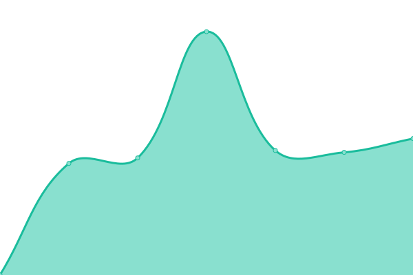

# [📈 Live Status](https://MacKisco.github.io/upptime): <!--live status--> **🟩 All systems operational**

This repository contains the open-source uptime monitor and status page for [MacKisco](https://MacKisco.github.io/upptime), powered by [Upptime](https://github.com/upptime/upptime).

With [Upptime](https://upptime.js.org), you can get your own unlimited and free uptime monitor and status page, powered entirely by a GitHub repository. We use [Issues](https://github.com/MacKisco/upptime/issues) as incident reports, [Actions](https://github.com/MacKisco/upptime/actions) as uptime monitors, and [Pages](https://MacKisco.github.io/upptime) for the status page.

<!--start: status pages-->
<!-- This summary is generated by Upptime (https://github.com/upptime/upptime) -->
<!-- Do not edit this manually, your changes will be overwritten -->

| URL                                                      | Status | History                                                                                                             | Response Time                                                                                | Uptime                                                                                                                                                                                                                                         |
| -------------------------------------------------------- | ------ | ------------------------------------------------------------------------------------------------------------------- | -------------------------------------------------------------------------------------------- | ---------------------------------------------------------------------------------------------------------------------------------------------------------------------------------------------------------------------------------------------- |
| [Le Petit Atelier Luthi](https://lepetitatelierluthi.fr) | 🟩 Up  | [le-petit-atelier-luthi.yml](https://github.com/MacKisco/upptime/commits/master/history/le-petit-atelier-luthi.yml) |  2568ms |  |
| [L'Eire de rien](https://leirederien.fr)                 | 🟩 Up  | [l-eire-de-rien.yml](https://github.com/MacKisco/upptime/commits/master/history/l-eire-de-rien.yml)                 |  1898ms         |                  |
| [Aviva-stats](https://aviva-stats.netlify.app)           | 🟩 Up  | [aviva-stats.yml](https://github.com/MacKisco/upptime/commits/master/history/aviva-stats.yml)                       |  211ms             |                        |

<!--end: status pages-->

[**Visit our status website →**](https://MacKisco.github.io/upptime)

## 📄 License

- Powered by: [Upptime](https://github.com/upptime/upptime)
- Code: [MIT](./LICENSE) © [MacKisco](https://MacKisco.github.io/upptime)
- Data in the `./history` directory: [Open Database License](https://opendatacommons.org/licenses/odbl/1-0/)
